# AI-Powered WhatsApp Chatbot Domain Model Documentation

## 1. Introduction

This document presents the domain model for an AI-Powered WhatsApp Chatbot designed to enhance student support in South African Higher Education Institutions. The model captures the key entities, their attributes, behaviors, and relationships within the system. This domain model serves as a foundation for the system's design and implementation, ensuring alignment with the functional requirements and user stories identified in previous assignments.

## 2. Domain Classes and Business Rules

### 2.1 Core User Classes

#### User
- **Description**: Abstract base class representing any system user
- **Attributes**: userId, name, phoneNumber, email, institutionId, status, lastActive
- **Methods**: registerAccount(), updateProfile(), deactivateAccount(), sendQuery(), checkStatus()
- **Business Rules**:
  * All users must have a valid phone number to receive WhatsApp messages
  * User status follows a defined lifecycle (from UNREGISTERED to ACTIVE, etc.)
  * User accounts become DORMANT after 30 days of inactivity
  * Users can opt out of the service, changing their status to BLACKLISTED

#### Student
- **Description**: Represents a university student who is the primary user of the system
- **Attributes**: studentNumber, programCode, yearOfStudy, feesBalance
- **Methods**: checkSchedule(), viewMaterials(), checkFeeStatus(), createSupportTicket()
- **Business Rules**:
  * Students can only access course materials for courses they are enrolled in
  * Fee status information is only available to the student and authorized administrators
  * Students can create support tickets for any type of query or issue

#### Administrator
- **Description**: Represents university staff with administrative privileges
- **Attributes**: adminLevel, department
- **Methods**: createAnnouncement(), broadcastMessage(), generateReport(), manageUsers()
- **Business Rules**:
  * Administrators can only send broadcasts to students within their department
  * Administrative privileges are determined by adminLevel (basic, intermediate, advanced)
  * Only administrators can create system-wide announcements

#### Lecturer
- **Description**: Represents teaching staff who upload course materials
- **Attributes**: staffId, department, courses
- **Methods**: uploadMaterial(), sendCourseAnnouncement(), viewCourseStatistics()
- **Business Rules**:
  * Lecturers can only manage materials for courses they are assigned to
  * Course announcements can only be sent to enrolled students
  * All material uploads require approval before publication

#### CounselingStaff
- **Description**: Represents mental health professionals who respond to distress alerts
- **Attributes**: certificationLevel, specialization
- **Methods**: respondToDistressAlert(), scheduleFollowUp(), recordInterventionNotes()
- **Business Rules**:
  * High-severity alerts must be handled by counselors with appropriate certification
  * All interventions must be documented and include follow-up plans
  * Counselors must respond to alerts within timeframes based on severity

### 2.2 Communication Classes

#### Query
- **Description**: Represents a student inquiry or request sent via WhatsApp
- **Attributes**: queryId, content, timestamp, category, status, intentScore
- **Methods**: process(), escalate(), classify(), resolveWithResponse()
- **Business Rules**:
  * Queries with low confidence in NLP understanding must be escalated
  * All queries must be categorized for reporting and improvement purposes
  * Queries containing sensitive information are flagged for special handling

#### Response
- **Description**: Represents the system's reply to a student query
- **Attributes**: responseId, content, timestamp, responseType, attachments
- **Methods**: deliver(), trackDeliveryStatus(), recordFeedback()
- **Business Rules**:
  * All responses must be tracked for delivery confirmation
  * Complex responses may include attachments (PDF, images, links)
  * Response content must follow institutional communication policies

#### Notification
- **Description**: Represents system-initiated communications to users
- **Attributes**: notificationId, content, timestamp, status, priority, expiryDate
- **Methods**: send(), reschedule(), cancel(), trackReadStatus()
- **Business Rules**:
  * High priority notifications are resent if not read within 24 hours
  * All notifications have an expiry date after which they are not delivered
  * Notifications follow a state lifecycle from CREATED to READ or EXPIRED

#### ChatSession
- **Description**: Represents a conversation between a user and the chatbot
- **Attributes**: sessionId, startTime, endTime, channelType, interactionCount
- **Methods**: analyzeIntent(), recordInteraction(), transferToHuman(), endSession()
- **Business Rules**:
  * Sessions time out after 30 minutes of inactivity
  * All interactions within a session are recorded for quality improvement
  * Sessions can be transferred to human support when needed

### 2.3 Academic and Financial Classes

#### CourseMaterial
- **Description**: Represents educational content uploaded by lecturers
- **Attributes**: materialId, title, description, courseCode, version, uploadDate, status, fileType, fileSize
- **Methods**: publish(), unpublish(), update(), archive()
- **Business Rules**:
  * Materials follow an approval workflow before becoming available
  * Version control tracks all changes to materials
  * Materials can be unpublished temporarily if errors are found
  * Obsolete materials are archived rather than deleted

#### PaymentTransaction
- **Description**: Represents financial transactions for student fees
- **Attributes**: transactionId, amount, timestamp, paymentMethod, status, referenceNumber
- **Methods**: processPayment(), verifyPayment(), generateReceipt(), reconcile()
- **Business Rules**:
  * All transactions must be reconciled within 24 hours
  * Failed transactions can be retried up to 3 times
  * Transaction disputes must be resolved within 7 business days
  * Receipt generation is automatic for completed transactions

### 2.4 Support Classes

#### SupportTicket
- **Description**: Represents a formal request for assistance
- **Attributes**: ticketId, subject, description, creationDate, status, priority, category, slaDeadline
- **Methods**: assignToAgent(), updateStatus(), escalate(), resolveTicket()
- **Business Rules**:
  * Tickets have SLA deadlines based on priority (high: 4 hours, medium: 24 hours, low: 48 hours)
  * Tickets not addressed within SLA timeframe are automatically escalated
  * Ticket resolution requires student confirmation
  * Tickets can be reopened within 7 days of being closed

#### DistressAlert
- **Description**: Represents detection of mental health concerns in student communications
- **Attributes**: alertId, detectionTime, severity, triggerPhrases, status, responseTime
- **Methods**: notifyCounselor(), escalateToEmergency(), logIntervention(), scheduleFollowUp()
- **Business Rules**:
  * High-severity alerts trigger immediate emergency protocols
  * All alerts require documentation of intervention and outcome
  * Follow-up must be scheduled for all medium and high severity cases
  * Response time is monitored against urgency requirements

### 2.5 Technical Infrastructure Classes

#### NLPEngine
- **Description**: Encapsulates natural language processing capabilities
- **Attributes**: modelVersion, confidenceThreshold, languageSupport
- **Methods**: processQuery(), extractIntent(), determineEntities(), detectSentiment(), generateResponse()
- **Business Rules**:
  * Confidence scores below threshold trigger human verification
  * Sentiment analysis identifies potential distress signals
  * The engine supports multiple South African languages
  * Regular model updates improve understanding capabilities

#### WhatsAppIntegration
- **Description**: Manages communication with the WhatsApp API
- **Attributes**: apiKey, phoneNumberId, webhookUrl
- **Methods**: sendMessage(), receiveMessage(), sendMedia(), verifyWebhook()
- **Business Rules**:
  * Message delivery attempts timeout after 30 seconds
  * Failed message deliveries are retried up to 3 times
  * All API interactions are logged for audit purposes
  * Rate limiting prevents system overload

#### AcademicDatabase
- **Description**: Interface to university academic and financial systems
- **Attributes**: connectionString, lastSyncTime
- **Methods**: getStudentSchedule(), getCourseMaterials(), getRegistrationDeadlines(), getPaymentInformation()
- **Business Rules**:
  * Data is synchronized every 6 hours to maintain freshness
  * Personal information access is strictly controlled and audited
  * Database unavailability triggers fallback to cached information
  * All data access follows POPIA compliance requirements

## 3. Class Diagram

The following class diagram represents the domain model with all classes, attributes, methods, and relationships:

```mermaid
classDiagram
    class User {
        -userId: String
        -name: String
        -phoneNumber: String
        -email: String
        -institutionId: String
        -status: UserStatus
        -lastActive: DateTime
        +registerAccount()
        +updateProfile()
        +deactivateAccount()
        +sendQuery()
        +checkStatus()
    }

    class Student {
        -studentNumber: String
        -programCode: String
        -yearOfStudy: Integer
        -feesBalance: Double
        +checkSchedule()
        +viewMaterials()
        +checkFeeStatus()
        +createSupportTicket()
    }

    class Administrator {
        -adminLevel: String
        -department: String
        +createAnnouncement()
        +broadcastMessage()
        +generateReport()
        +manageUsers()
    }
    
    class Lecturer {
        -staffId: String
        -department: String
        -courses: List~String~
        +uploadMaterial()
        +sendCourseAnnouncement()
        +viewCourseStatistics()
    }

    class CounselingStaff {
        -certificationLevel: String
        -specialization: String
        +respondToDistressAlert()
        +scheduleFollowUp()
        +recordInterventionNotes()
    }

    class Query {
        -queryId: String
        -content: String
        -timestamp: DateTime
        -category: String
        -status: QueryStatus
        -intentScore: Double
        +process()
        +escalate()
        +classify()
        +resolveWithResponse()
    }

    class Response {
        -responseId: String
        -content: String
        -timestamp: DateTime
        -responseType: String
        -attachments: List~Attachment~
        +deliver()
        +trackDeliveryStatus()
        +recordFeedback()
    }

    class Notification {
        -notificationId: String
        -content: String
        -timestamp: DateTime
        -status: NotificationStatus
        -priority: Integer
        -expiryDate: DateTime
        +send()
        +reschedule()
        +cancel()
        +trackReadStatus()
    }

    class CourseMaterial {
        -materialId: String
        -title: String
        -description: String
        -courseCode: String
        -version: String
        -uploadDate: DateTime
        -status: MaterialStatus
        -fileType: String
        -fileSize: Integer
        +publish()
        +unpublish()
        +update()
        +archive()
    }

    class SupportTicket {
        -ticketId: String
        -subject: String
        -description: String
        -creationDate: DateTime
        -status: TicketStatus
        -priority: String
        -category: String
        -slaDeadline: DateTime
        +assignToAgent()
        +updateStatus()
        +escalate()
        +resolveTicket()
    }

    class PaymentTransaction {
        -transactionId: String
        -amount: Double
        -timestamp: DateTime
        -paymentMethod: String
        -status: TransactionStatus
        -referenceNumber: String
        +processPayment()
        +verifyPayment()
        +generateReceipt()
        +reconcile()
    }

    class DistressAlert {
        -alertId: String
        -detectionTime: DateTime
        -severity: String
        -triggerPhrases: List~String~
        -status: AlertStatus
        -responseTime: DateTime
        +notifyCounselor()
        +escalateToEmergency()
        +logIntervention()
        +scheduleFollowUp()
    }

    class ChatSession {
        -sessionId: String
        -startTime: DateTime
        -endTime: DateTime
        -channelType: String
        -interactionCount: Integer
        +analyzeIntent()
        +recordInteraction()
        +transferToHuman()
        +endSession()
    }

    class NLPEngine {
        -modelVersion: String
        -confidenceThreshold: Double
        -languageSupport: List~String~
        +processQuery(query: String)
        +extractIntent(text: String)
        +determineEntities(text: String)
        +detectSentiment(text: String)
        +generateResponse(intent: String, entities: Map)
    }

    class WhatsAppIntegration {
        -apiKey: String
        -phoneNumberId: String
        -webhookUrl: String
        +sendMessage(recipient: String, content: String)
        +receiveMessage(payload: JSON)
        +sendMedia(recipient: String, mediaUrl: String, type: String)
        +verifyWebhook(token: String)
    }

    class AcademicDatabase {
        -connectionString: String
        -lastSyncTime: DateTime
        +getStudentSchedule(studentId: String)
        +getCourseMaterials(courseId: String)
        +getRegistrationDeadlines()
        +getPaymentInformation(studentId: String)
    }

    %% Enumerations
    class UserStatus {
        <<enumeration>>
        UNREGISTERED
        REGISTERED
        ACTIVE
        SUSPENDED
        DORMANT
        ARCHIVED
        TERMINATED
        BLACKLISTED
    }

    class QueryStatus {
        <<enumeration>>
        NEW
        PROCESSING
        UNDERSTOOD
        FETCHING_DATA
        RESPONSE_READY
        RESPONDED
        ESCALATION_REQUIRED
        ESCALATED
        REJECTED
    }

    class NotificationStatus {
        <<enumeration>>
        CREATED
        SCHEDULED
        READY_TO_SEND
        SENDING
        SENT
        FAILED
        DELIVERED
        READ
        EXPIRED
        ACTIONED
    }

    class MaterialStatus {
        <<enumeration>>
        DRAFT
        PENDING
        APPROVED
        PUBLISHED
        VERSION_OBSOLETE
        DEPRECATED
        UNPUBLISHED
        ARCHIVED
    }

    class TicketStatus {
        <<enumeration>>
        NEW
        OPEN
        IN_PROGRESS
        ON_HOLD
        RESOLVED
        CLOSED
        ESCALATED
        REJECTED
    }

    class TransactionStatus {
        <<enumeration>>
        INITIATED
        PROCESSING
        AUTHORIZED
        COMPLETED
        DECLINED
        REVERSED
        RECONCILED
        DISPUTED
        RESOLVED
        EXPIRED
    }

    class AlertStatus {
        <<enumeration>>
        DETECTED
        ANALYZING
        LOW_RISK
        MEDIUM_RISK
        HIGH_RISK
        NOTIFIED
        ACKNOWLEDGED
        IN_PROGRESS
        ESCALATED
        RESOLVED
        CLOSED
    }

    %% Relationships
    User <|-- Student
    User <|-- Administrator
    User <|-- Lecturer
    User <|-- CounselingStaff

    User "1" -- "0..*" Query : submits
    Query "1" -- "0..1" Response : generates
    User "1" -- "0..*" Notification : receives
    User "1" -- "0..*" ChatSession : participates in
    
    Student "1" -- "0..*" CourseMaterial : accesses
    Student "1" -- "0..*" SupportTicket : creates
    Student "1" -- "0..*" PaymentTransaction : makes
    
    Lecturer "1" -- "0..*" CourseMaterial : uploads
    Administrator "1" -- "0..*" Notification : creates
    
    ChatSession "1" -- "1..*" Query : contains
    ChatSession "1" -- "0..*" Response : includes
    
    Query "0..*" -- "1" NLPEngine : processed by
    Response "0..*" -- "1" NLPEngine : generated by
    
    CounselingStaff "1..*" -- "0..*" DistressAlert : responds to
    ChatSession "1" -- "0..*" DistressAlert : may trigger
    
    WhatsAppIntegration "1" -- "0..*" ChatSession : facilitates
    WhatsAppIntegration "1" -- "0..*" Notification : delivers
    
    AcademicDatabase "1" -- "1..*" Student : stores data for
    AcademicDatabase "1" -- "1..*" CourseMaterial : contains
    AcademicDatabase "1" -- "1..*" PaymentTransaction : records
```

## 4. Key Design Decisions

### 4.1 User Hierarchy
The model uses inheritance to represent different user types (Student, Administrator, Lecturer, CounselingStaff) that share common attributes and behaviors while having specialized characteristics. This approach simplifies user management while allowing for type-specific functionality.

### 4.2 State Management
Each major class with a complex lifecycle (Query, Notification, CourseMaterial, SupportTicket, PaymentTransaction, DistressAlert) has an associated status enumeration that directly aligns with the state transition diagrams created in previous assignments. This ensures consistency between behavioral models and class structure.

### 4.3 Separation of Technical and Domain Concerns
The NLPEngine, WhatsAppIntegration, and AcademicDatabase classes encapsulate technical functionality, separating infrastructure concerns from domain logic. This allows the domain model to focus on business rules and behaviors while clearly defining integration points.

### 4.4 Communication Patterns
The model distinguishes between different types of communication:
- Queries: Student-initiated inquiries
- Responses: System replies to queries
- Notifications: System-initiated messages

This separation allows for precise handling of different communication scenarios while maintaining a consistent structure.

### 4.5 Relationship Modeling
Relationships between classes are carefully designed to reflect real-world connections:
- Association relationships (e.g., Student creates SupportTicket) represent interactions
- Composition relationships (e.g., ChatSession contains Queries) represent ownership
- Many-to-many relationships (e.g., CounselingStaff responds to DistressAlert) capture complex interactions

## 5. Traceability to Requirements

This domain model addresses all functional requirements identified in previous assignments:

| Requirement | Addressed By |
|-------------|-------------|
| FR-001: Process student inquiries about registration | Query, NLPEngine, ChatSession classes |
| FR-002: Access student academic schedules | AcademicDatabase, Student methods |
| FR-003: Provide accurate academic deadlines | AcademicDatabase integration |
| FR-004: Present course information | CourseMaterial class |
| FR-005: Update learning materials | CourseMaterial class, Lecturer methods |
| FR-007: Enable administrative broadcasts | Administrator methods, Notification class |
| FR-008: Send payment reminders | Notification class, PaymentTransaction class |
| FR-009: Escalate complex queries | Query.escalate(), SupportTicket class |
| FR-010: Monitor system performance | All status tracking attributes |
| FR-012: Process financial queries | PaymentTransaction class |
| FR-013: Implement data security | User status management, authentication |
| FR-014: Maintain regulatory compliance | Data handling in all classes |
| FR-015: Support multimedia content | Response.attachments attribute |

## 6. Conclusion

This domain model provides a comprehensive foundation for the AI-Powered WhatsApp Chatbot system. The class structure, relationships, and business rules capture the essential behaviors and constraints required to fulfill the functional requirements and user stories identified in previous assignments.

The model balances technical complexity with domain clarity, ensuring that the system can be implemented in a way that meets stakeholder needs while maintaining a cohesive architecture. The clear delineation of responsibilities and relationships will guide the detailed design and implementation phases of the project.
